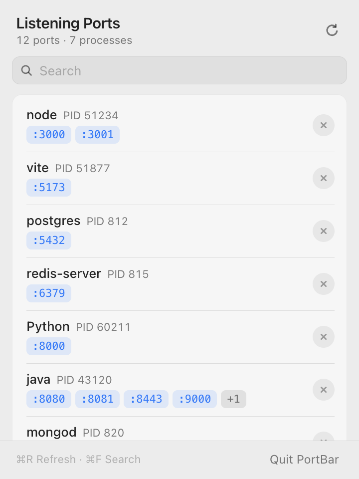
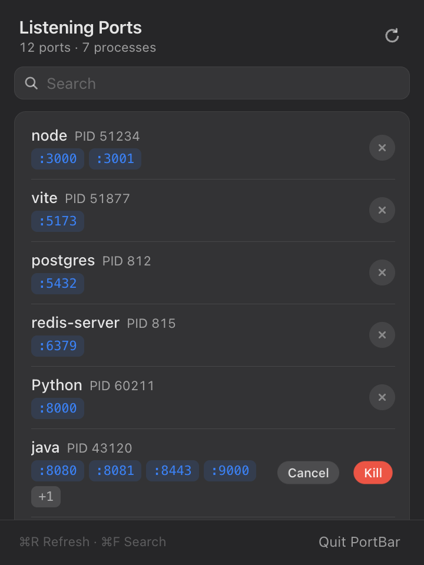

# PortBar

A lightweight macOS menu bar app that shows which local TCP ports are being listened on, which process owns each one, and lets you kill that process in one click.

Built with [Tauri 2](https://tauri.app), Rust and vanilla TypeScript.

<p align="center">
  
  &nbsp;&nbsp;
  
</p>

<p align="center"><sub>Light mode (left) and dark mode with a pending kill confirmation (right). In the app, the panel background is translucent system vibrancy.</sub></p>

## Features

- **Menu bar only** — no Dock icon; click the tray icon to open a native-looking popover with system vibrancy (Liquid Glass on macOS 26+).
- **Listening ports at a glance** — processes are grouped with their name, PID and every port they listen on. Hover a port to see the bound addresses.
- **Know what each process is** — shows a shortened command line (e.g. `node vite --port 5173`) and the project directory, so you can tell your `node` processes apart.
- **Open in browser** — click a port to open `http://localhost:<port>`. Right-click a port or row to copy the URL, port, PID, command or path, or to show the directory in Finder.
- **One-click kill** — click `×`, then confirm. PortBar sends `SIGTERM` and falls back to `SIGKILL` if the process hasn't exited after 1.5 s.
- **Search** — filter by port, process name, PID or address.
- **Follows the system language** — English and Simplified Chinese, switched automatically.
- **Light & dark mode** — follows the system appearance.

## Requirements

- macOS 11 or later
- [Rust](https://rustup.rs) 1.77.2+
- Node.js 20+ and [pnpm](https://pnpm.io)
- Xcode Command Line Tools (`xcode-select --install`)

## Getting started

```bash
pnpm install
pnpm tauri dev
```

The app starts in the background. Look for the port icon in the menu bar.

To build a release `.app` and `.dmg`:

```bash
pnpm tauri build
```

The bundles are written to `src-tauri/target/release/bundle/`.

## Usage

| Action | How |
| --- | --- |
| Open / close the panel | Left-click the menu bar icon (the panel also closes when it loses focus) |
| Quit | Right-click the menu bar icon → **Quit PortBar**, or the button in the panel footer |
| Refresh | `⌘R` or the refresh button (the list also refreshes every time the panel opens) |
| Search | `⌘F`, then type a port, process name, PID or address |
| Open a port in the browser | Click the port tag, e.g. `:3000` |
| Copy / Show in Finder | Right-click a port tag or a row |
| Kill a process | Click `×`, then **Kill** |
| Cancel a kill | Click **Cancel**, press `Esc`, click anywhere else, or wait 3 s |
| Clear search | `Esc` |

## Limitations

- **Only your own processes are listed.** PortBar runs `lsof` without root, so ports held by system services or other users don't appear, and they couldn't be killed without admin rights anyway.
- **TCP only.** UDP has no real "listening" state and would add a lot of noise (mDNS and similar). To include it, add `-iUDP` to the `lsof` arguments in `src-tauri/src/ports.rs`.
- **Not Mac App Store compatible.** The translucent window requires Tauri's `macOSPrivateApi`.

## Development

```bash
pnpm build                                                       # type-check + bundle frontend
cargo test   --manifest-path src-tauri/Cargo.toml                # Rust unit tests
cargo clippy --manifest-path src-tauri/Cargo.toml -- -D warnings # lint
```

Project layout:

```text
src/                  Frontend (Vite + TypeScript, no framework)
  api.ts              Typed wrappers around Tauri commands
  i18n.ts             English / Chinese message bundles
  main.ts             State and rendering
src-tauri/src/
  ports.rs            lsof parsing and process signalling
  commands.rs         Tauri command handlers
  tray.rs             Menu bar icon and panel positioning
  error.rs            Error type sent to the frontend as { code, pid?, detail? }
  locale.rs           System language detection
.cursor/rules/        Project conventions for Cursor
```
